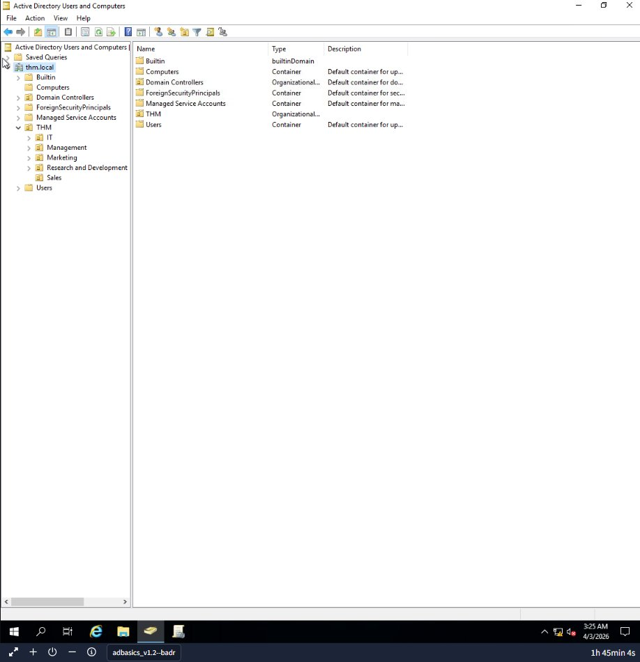
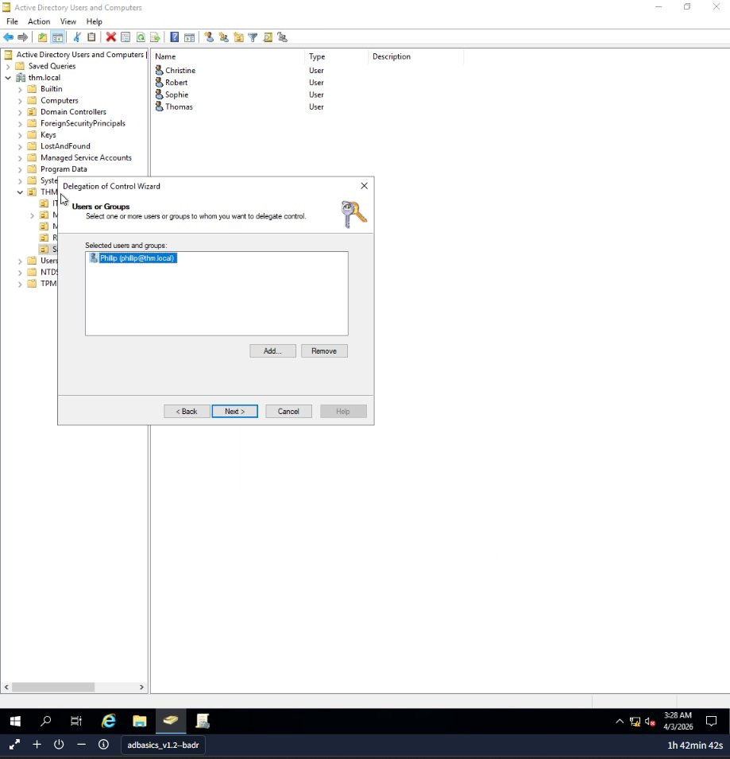
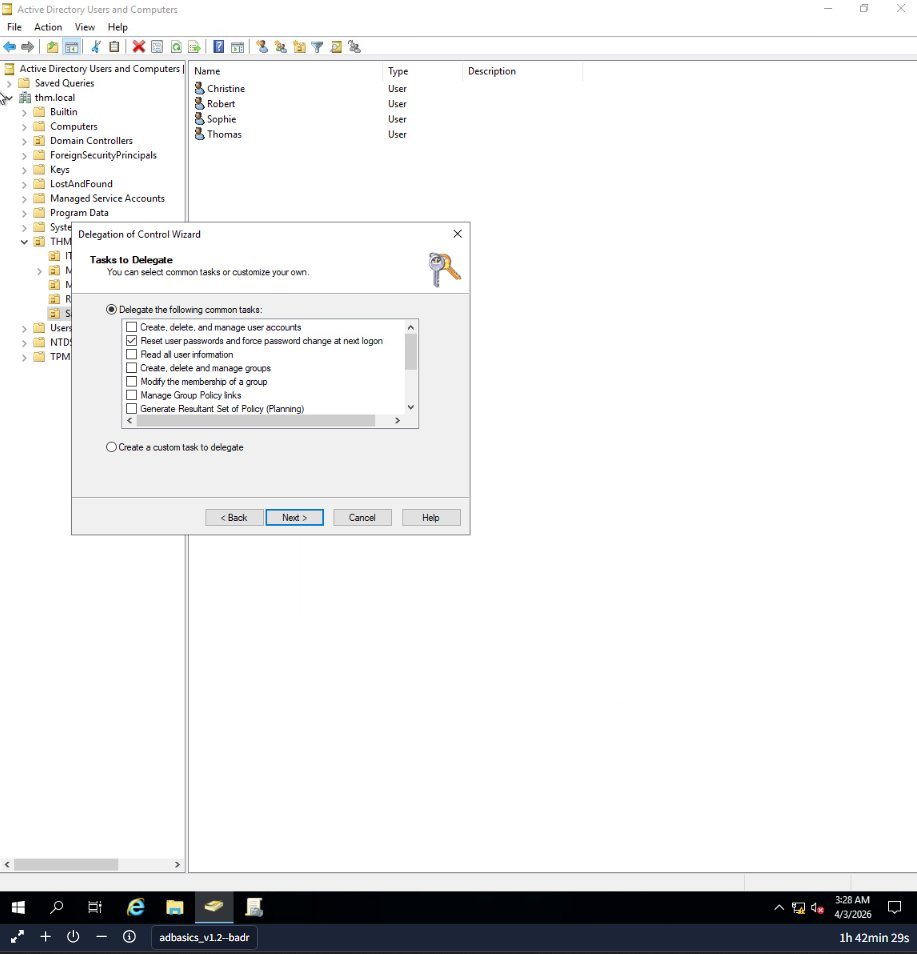
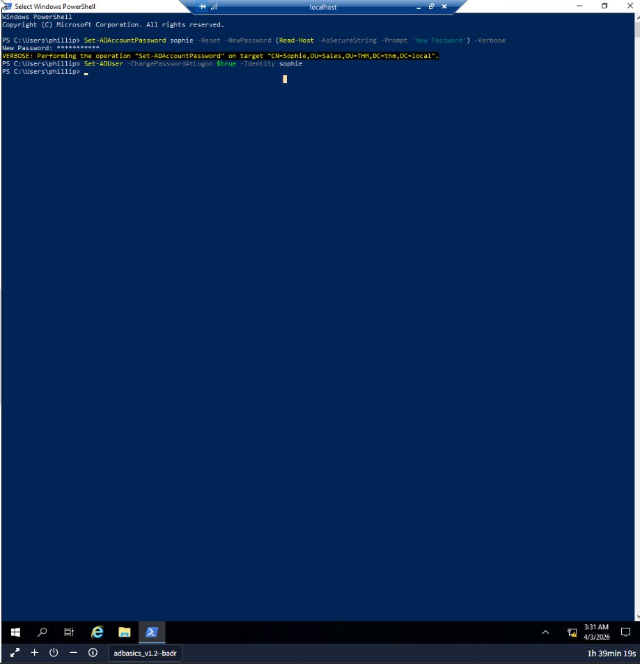
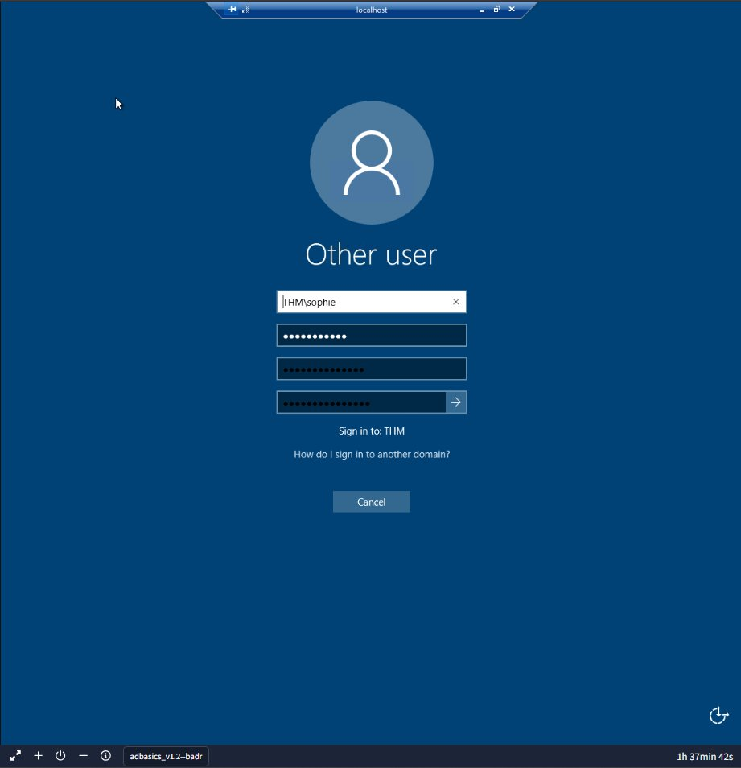
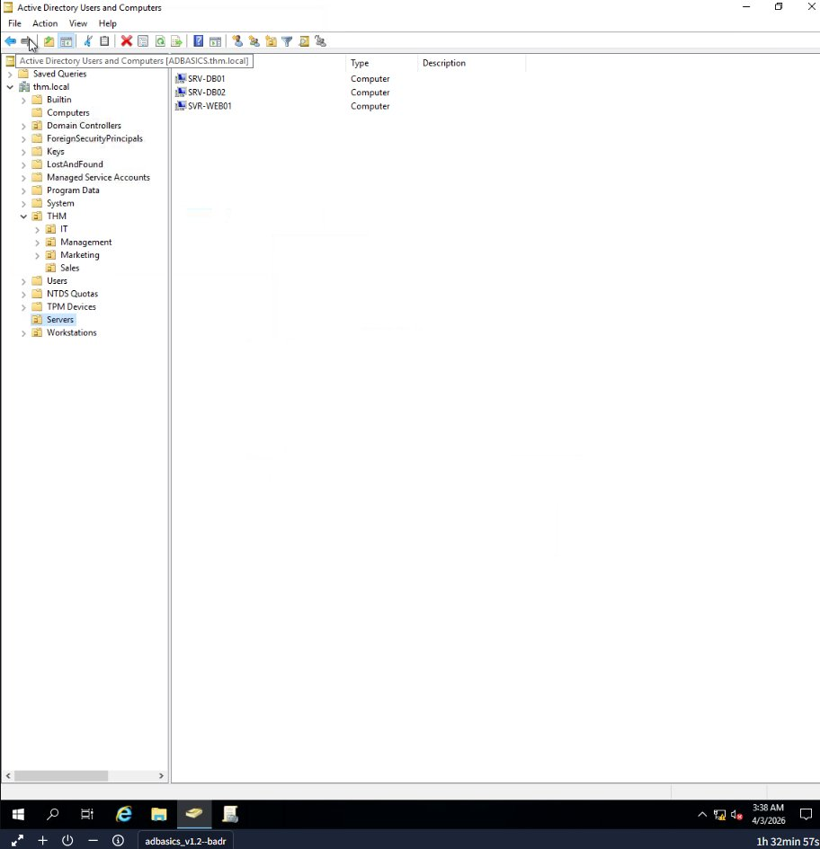
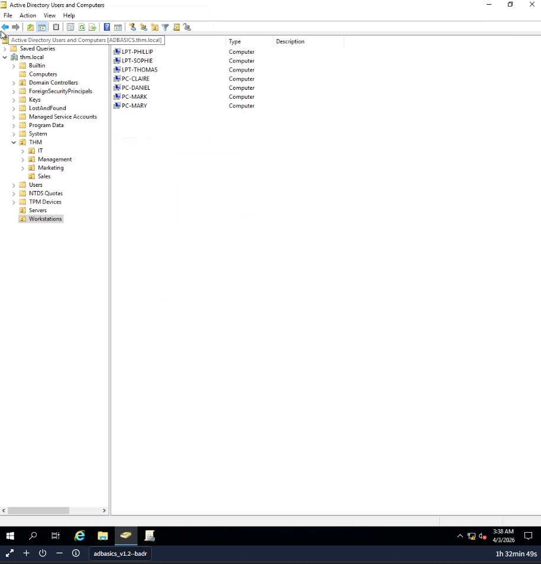
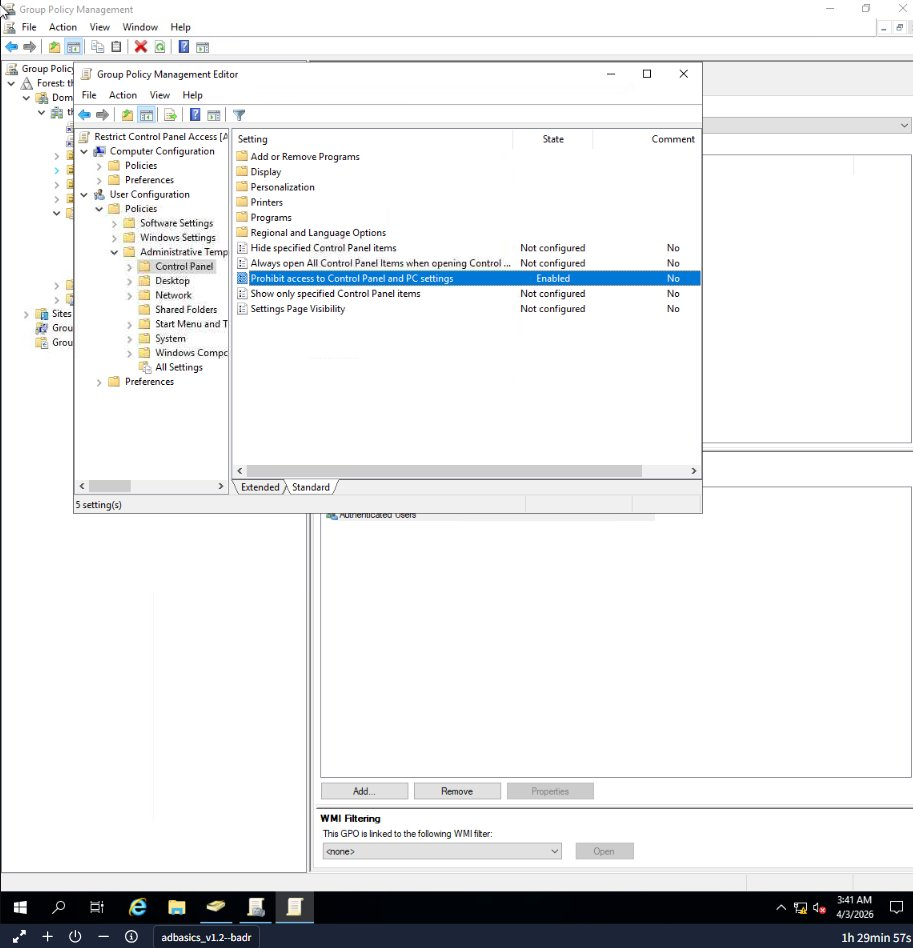
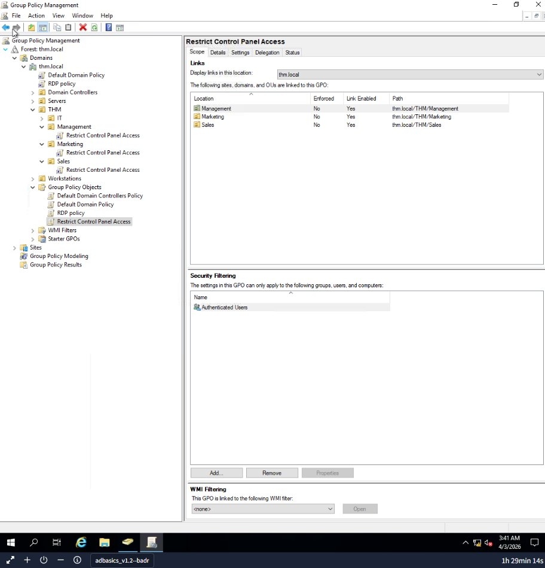
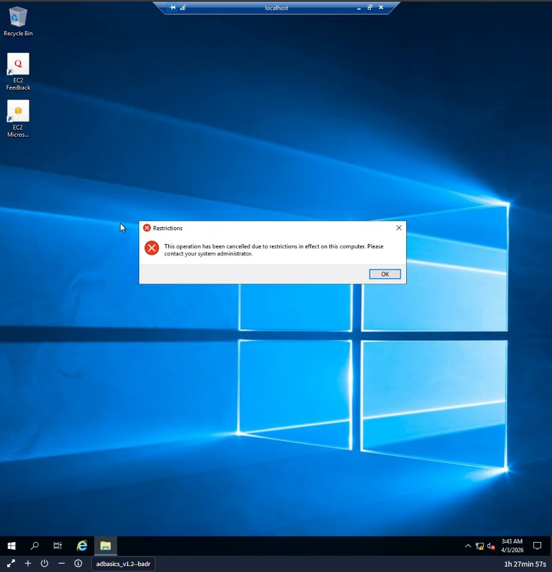

# Active Directory Basics Lab

Hands-on Active Directory administration lab covering domain management, user delegation, Group Policy enforcement, and authentication protocols in a Windows Server environment.

## Objective

Configure and manage a Windows Active Directory domain from scratch — creating organizational units, delegating administrative tasks, enforcing security policies via GPOs, and verifying access controls across multiple user accounts.

## Environment

| Component | Detail |
|-----------|--------|
| Domain | THM.local |
| Domain Controller | Windows Server (ADBASICS) |
| Role | IT Administrator |
| Tools | Active Directory Users and Computers, Group Policy Management Console, PowerShell |

## Lab Walkthrough

### 1. Active Directory Structure and Organizational Units

Opened **Active Directory Users and Computers** and explored the domain structure. The `THM` organizational unit contained five department OUs: IT, Management, Marketing, Research and Development, and Sales.

**Key concepts:**
- **Active Directory** is the centralized repository for credentials and resource management across a Windows domain
- **Domain Controller (DC)** is the server running AD services that handles authentication and policy enforcement
- **Organizational Units (OUs)** are containers used to group users, computers, and other objects so policies can be applied consistently
- **Domain Admins** is the group that administrates all computers and resources in a domain
- Machine accounts follow the naming convention `MACHINE_NAME$` (e.g., `TOM-PC$`)



---

### 2. Delegation of Control

Delegated password reset privileges to a specific user (Phillip) scoped only to the Sales OU using the **Delegation of Control Wizard**.

**Steps:**
1. Right-clicked the **Sales OU** → Delegate Control
2. Added **Phillip** (phillip@thm.local) as the delegated user
3. Selected **"Reset user passwords and force password change at next logon"** as the delegated task
4. Completed the wizard

**Why this matters:** Delegation follows the principle of least privilege. Phillip can reset passwords for Sales users only — not the entire domain. This is how enterprise environments scope admin rights without giving out full Domain Admin access.




---

### 3. Password Reset via PowerShell

Logged in as Phillip via RDP and used PowerShell to reset Sophie's password, verifying that the delegated permissions were working correctly.

```powershell
# Reset Sophie's password
Set-ADAccountPassword sophie -Reset -NewPassword (Read-Host -AsSecureString -Prompt 'New Password') -Verbose

# Force password change at next logon
Set-ADUser -ChangePasswordAtLogon $true -Identity sophie
```

**Output confirmed:** `Performing the operation "Set-ADAccountPassword" on target "CN=Sophie,OU=Sales,OU=THM,DC=thm,DC=local".`

Logged in as Sophie with the new password to verify, and successfully retrieved the flag from her desktop.




---

### 4. Managing Computer Objects

Organized computer objects from the default `Computers` container into proper OUs for policy targeting:

**Servers OU:**
- SRV-DB01, SRV-DB02 (database servers)
- SVR-WEB01 (web server)

**Workstations OU:**
- LPT-PHILLIP, LPT-SOPHIE, LPT-THOMAS (laptops)
- PC-CLAIRE, PC-DANIEL, PC-MARK, PC-MARY (desktops)

**Why this matters:** Separating servers and workstations into different OUs allows different GPOs to be applied to each. Servers need different security baselines than end-user workstations.




---

### 5. Group Policy Objects (GPOs)

Created and deployed a GPO to restrict Control Panel access across multiple departments.

**Steps:**
1. Created a new GPO: **"Restrict Control Panel Access"**
2. Edited the GPO → User Configuration → Policies → Administrative Templates → Control Panel
3. Enabled **"Prohibit access to Control Panel and PC settings"**
4. Linked the GPO to three OUs: **Management, Marketing, and Sales**

**Verification:** Logged in as Mark (Marketing department) and attempted to open Control Panel. Received the restriction message: *"This operation has been cancelled due to restrictions in effect on this computer."*

The IT OU was intentionally excluded from this GPO, allowing IT staff to retain Control Panel access.





---

### 6. Authentication Methods

**Kerberos** (default in modern AD):
- Uses a ticket-based system — users authenticate once and receive a Ticket Granting Ticket (TGT) from the Key Distribution Center (KDC)
- TGT is used to request service tickets for accessing specific resources without re-entering credentials
- Relies on symmetric key cryptography and timestamps to prevent replay attacks

**NetNTLM** (legacy, still present):
- Challenge-response protocol where the server sends a challenge and the client responds with a hash derived from the password
- No ticket system — authentication happens per-session
- Kept for backward compatibility but considered weaker than Kerberos

---

### 7. Trees, Forests, and Trusts

- **Tree**: A group of domains sharing the same namespace (e.g., thm.local → us.thm.local → eu.thm.local)
- **Forest**: A collection of trees with different namespaces under a shared schema and global catalog
- **Trust Relationship**: Configured between domains so users in Domain A can access resources in Domain B. Trusts can be one-way or two-way

---

## Key Takeaways

- **OUs** are the foundation for applying policies — group users and computers logically by department or function
- **Delegation** enables least-privilege administration by scoping specific rights to specific OUs
- **GPOs** centralize configuration management — one policy change propagates to thousands of machines
- **Kerberos** is the default and preferred authentication protocol in AD; NetNTLM is legacy
- **PowerShell AD cmdlets** (`Set-ADAccountPassword`, `Set-ADUser`) are essential for managing users at scale when GUI access isn't available
- Organizing **computer objects** into Servers/Workstations OUs enables targeted security baselines

## Tools Used

- Windows Server / Active Directory Domain Services
- Active Directory Users and Computers (ADUC)
- Group Policy Management Console (GPMC)
- PowerShell (AD module)
- Remote Desktop Protocol (RDP)
